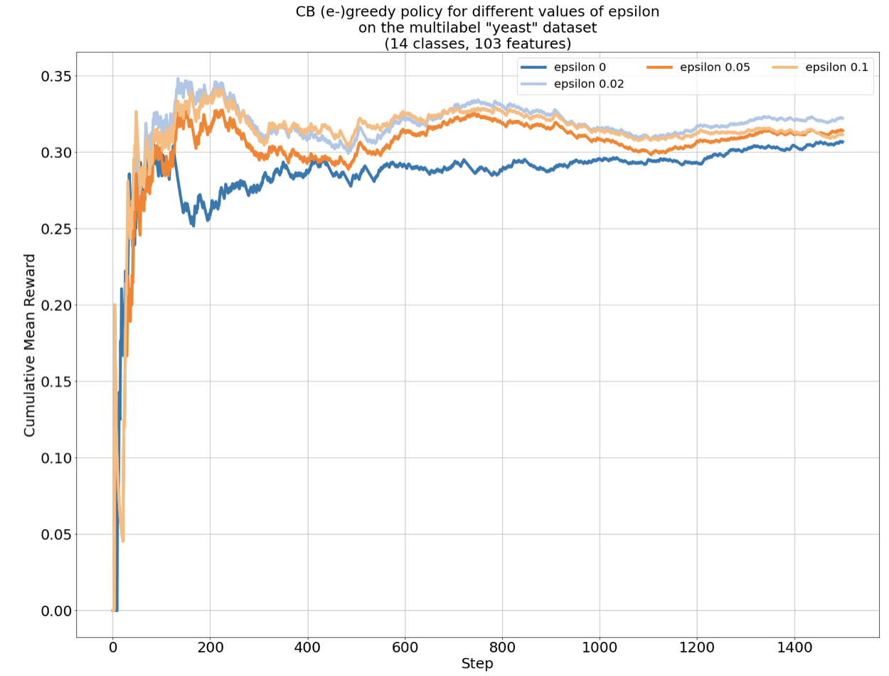
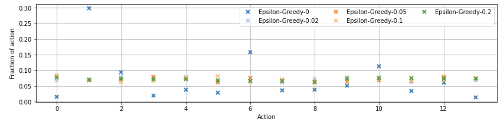

# cb
CS6741, "A Contextual Bandit Bake-off" (Bietti et al. 2018)

## Algorithms

#### (epsilon-)greedy

- IWR regression 
- Learning: reduction to off-policy optimization
- Hyperparameters for epsilon: {0, 0.02, 0.05, 0.1}

Example:

